```{r setup, include=FALSE}
options(htmltools.dir.version = FALSE)
knitr::opts_chunk$set(
  fig.width=9, fig.height=3.5, fig.retina=3,
  out.width = "100%",
  cache = FALSE,
  echo = TRUE,
  message = FALSE, 
  warning = FALSE,
  hiline = TRUE
)

library(RefManageR)
BibOptions(check.entries = FALSE,
           bib.style = "authoryear",
           cite.style = "alphabetic",
           style = "markdown",
           hyperlink = FALSE,
           dashed = FALSE)
#myBib <- ReadBib("bib/2_species.bib", check = FALSE)
```

```{r xaringan-themer, include=FALSE, warning=FALSE}
library(xaringanthemer)

# style_duo_accent(
#   primary_color = "#1381B0",
#   secondary_color = "#FF961C",
#   inverse_header_color = "#FFFFFF"
# )

style_mono_light(base_color = "#23395b")

#https://mycolor.space/?hex=%2323395B&sub=1 
#"Generic gradient" - #23395B #006287 #008E9D #00B897 #89DD81 #F9F871
#"Matching gradient" (reverse) - #23395B #494E77 #716292 #9C77AA #C88DBF #F5A3D0


library(knitr)
library(kableExtra)
```


```{r xaringan-tile-view, echo=FALSE}
# xaringanExtra::use_tile_view()
```

class: center, middle

### We want to measure biodiversity everywhere, all the time...

```{r echo = F, fig.align = 'center', out.width = '80%'}
knitr::include_graphics("images/world_seasonality.gif")
```

.center[Remote sensing is pretty much the only way this can be achieved...]

---

layout: false

.pull-left[

## It's a rapidly growing field

```{r echo = F, fig.align = 'left', out.width = '90%'}
knitr::include_graphics("images/turner2003.png")
```

```{r echo = F, fig.align = 'left', out.width = '90%'}
knitr::include_graphics("images/satellitelaunches.jpg")
```

.footnote[Turner et al. 2003]
]

.pull-right[

```{r echo = F, fig.align = 'left', out.width = '75%'}
knitr::include_graphics("images/cavenderbares2020.png")
```
.footnote[Cavender-Bares et al. 2020]

]

---

layout: false

```{r echo = F, fig.align = 'center', out.width = '100%'}
knitr::include_graphics("images/bioscape_new.png")
```
.left[.footnote[...and the Cape is currently the epicentre of this endeavour | www.bioscape.io]]

---

layout: false

## BioSCape: Biodiversity Survey of the Cape

.pull-left[

- $>$ 150 scientists and conservation practitioners
- 19 teams (mixed US, RSA, other)
- terrestrial and aquatic
- 3 planes
- 6 instruments (2 x V-SWIR imaging spectrometers, hyperspectral thermal, multispectral (RGB + NIR) and 2 x LiDAR)
- fundamental and applied science
- mostly NASA funded, + NRF, UNESCO, others

```{r echo = F, fig.align = 'center', out.width = '100%'}
knitr::include_graphics("images/bioscape_kumu_hex.png")
```

]

.pull-right[
```{r echo = F, fig.align = 'center', out.width = '95%'}
knitr::include_graphics("images/bioscape_planes_portrait.png")
```
.footnote[www.bioscape.io]
]

---

class: center, middle

```{r echo = F, fig.align = 'center', out.width = '100%'}
knitr::include_graphics("images/Bioscape infographic_e3.jpg")
```

---

class: center, middle

## But how do we actually measure biodiversity with remote sensing?

---

background-image: url("images/nasa_ems.jpeg")
background-size: contain

text-color: white

.left-column[
## .my-style-white[The Electromagnetic Spectrum]
]

---

.left-column[

## Sensor types

Active vs passive

Multispectral vs hyperspectral

Variation within each type around spectral range and resolution, spatial resolution, revisit time, etc

.footnote[[Pettorelli et al. 2018](http://dx.doi.org/10.13140/RG.2.2.25962.41926)]
]

.right-column[
```{r echo = F, fig.align = 'center', out.width = '100%'}
knitr::include_graphics("images/pettorelli2018_sensors.png")
```
]

---

layout: false

## Multispectral vs hyperspectral (imaging spectrometers)

```{r echo = F, fig.align = 'center', out.width = '70%'}
knitr::include_graphics("images/multi vs hyper.png")
```

---

layout: false

.pull-left[
## Light detection and ranging (LiDAR)

```{r echo = F, fig.align = 'center', out.width = '100%'}
knitr::include_graphics("images/peninsula_lidar.png")
```

Proteaceae shrubs (dark green) surrounded by low shrubs, forbs and graminoids at Silvermine, TMNP. 

.footnote[Data from City of Cape Town]

]

.pull-right[
```{r echo = F, fig.align = 'center', out.width = '100%'}
knitr::include_graphics("images/purkis_klemas2011_lidar.png")
```

Light detection and ranging (LiDAR) uses active remote sensing by firing a "laser beam" to measure topography and the vertical structure of vegetation.

.footnote[Purkis and Klemas 2011]
]

---

### These are just numbers and not useful without ground observations

```{r echo = F, fig.align = 'center', out.width = '75%'}
knitr::include_graphics("images/turner2014.jpeg")
```

.footnote[[Turner 2014](https://doi-org.ezproxy.uct.ac.za/10.1126/science.1256014)]

---

class: center, middle

## But what are we trying to measure?

---

layout: false

.pull-left[
## There are many facets of biodiversity!

<br>

Each facet provides its own challenges and opportunities and require different methods of remote sensing.

]

.pull-right[
```{r echo = F, fig.align = 'center', out.width = '100%'}
knitr::include_graphics("images/Noss_Biodiversity.png")
```
.footnote[Noss 1990, _Conservation Biology_]
]

---

layout: false

.pull-left[
## There are many facets of biodiversity!

An advantage of remote sensing is that it can directly measure the structure, composition and function of biodiversity... 


```{r echo = F, fig.align = 'center', out.width = '120%'}
knitr::include_graphics("images/skidmore2021_fig1.png")
```
.footnote[Skidmore et al. 2021]

]

.pull-right[

```{r echo = F, fig.align = 'center', out.width = '90%'}
knitr::include_graphics("images/ebv_circle.png")
```


...at least from the scale of individuals up...

.footnote[https://geobon.org/]

]

---

class: center, middle

##Multispectral remote sensing 

---

class: center

##Productivity and Seasonality

```{r echo = F, fig.align = 'center', out.width = '80%'}
knitr::include_graphics("images/world_seasonality.gif")
```

---

class: center

##Land cover (and change)

```{r echo = F, fig.align = 'center', out.width = '50%'}
knitr::include_graphics("images/skowno2021.jpg")
```

.left[.footnote[Skowno et al. 2021]]

---

class: center

##Land cover change detection

```{r echo = F, fig.align = 'center', out.width = '70%'}
knitr::include_graphics("images/renosterveld_planet.gif")
```

.left[.footnote[Moncrieff 2022]]

---

class: center

##Land cover change time series

```{r echo = F, fig.align = 'center', out.width = '60%'}
knitr::include_graphics("images/moilwe.png")
```

.left[.footnote[Moilwe et al. in prep]]

---

class: center

## But there are challenges and limitations...

```{r echo = F, fig.align = 'center', out.width = '50%'}
knitr::include_graphics("images/schimel2020_scale.png")
```

.left[.footnote[Schimel et al. 2020]]

---

class: center, middle

## What about hyperspectral data?

---

class: center

## Spectral unmixing can detect "spectral signatures"

.left-column[

```{r echo = F, fig.align = 'center', out.width = '100%'}
knitr::include_graphics("images/jonaskop_class.png")
```

.smaller[Jonaskop, Riviersonderend Mountains]
]

.right-column[

Map species/types based on their reflectance of the electromagnetic spectrum!

```{r echo = F, fig.align = 'center', out.width = '50%'}
knitr::include_graphics("images/jonaskop_spectral_library.png")
```

Given a library of spectral signatures of different species and land cover types (endmembers), spectral unmixing infers the composition of each pixel from the possible mixes of endmembers. This gives a cover map of the majority endmember for each pixel (as here) and the fraction of each endmember for all pixels (next slide).

]

---

class: center

## Spectral unmixing can detect "spectral signatures"

```{r echo = F, fig.align = 'center', out.width = '100%'}
knitr::include_graphics("images/jonaskop_unmix.png")
```

.left[.footnote[Fractional cover of species (e.g. pines), functional groups or land cover types! ]]

---

layout: false

.pull-left[
## Mapping traits...

Imaging spectroscopy ("hyperspectral" remote sensing) allows direct measurement of leaf traits.

```{r echo = F, fig.align = 'left', out.width = '92%'}
knitr::include_graphics("images/cawse2021_spectra.png")
```

]

.pull-right[
```{r echo = F, fig.align = 'center', out.width = '100%'}
knitr::include_graphics("images/peninsula_hyperspec.png")
```
]

---

layout: false

```{r echo = F, fig.align = 'centre', out.width = '100%'}
knitr::include_graphics("images/traitmapping.png")
```

---

## Potential uses of trait maps?

.pull-left[

```{r echo = F, fig.align = 'center', out.width = '70%'}

```

MSc candidate using trait maps to infer the legacy impacts of invasive alien plants.

]

.pull-right[

```{r echo = F, fig.align = 'center', out.width = '70%'}

```

PhD candidate using traits to map landscape flammability.

]

---

layout: false

## Phylogenetic diversity?

```{r echo = F, fig.align = 'center', out.width = '70%'}
knitr::include_graphics("images/meireles2020.jpg")
```

.left[.footnote[Meireles et al. 2020]]

Leaf spectra are phylogenetically conserved for some regions, so it's possible that we'll be able to discern lineages using imaging spectroscopy...

---

layout: false

.pull-left[
## The Clanwilliam Cedar

An iconic critically endangered species...

```{r echo = F, fig.align = 'center', out.width = '100%'}
knitr::include_graphics("images/cedars_pic.png")
```

]

.pull-right[

```{r echo = F, fig.align = 'center', out.width = '62%'}
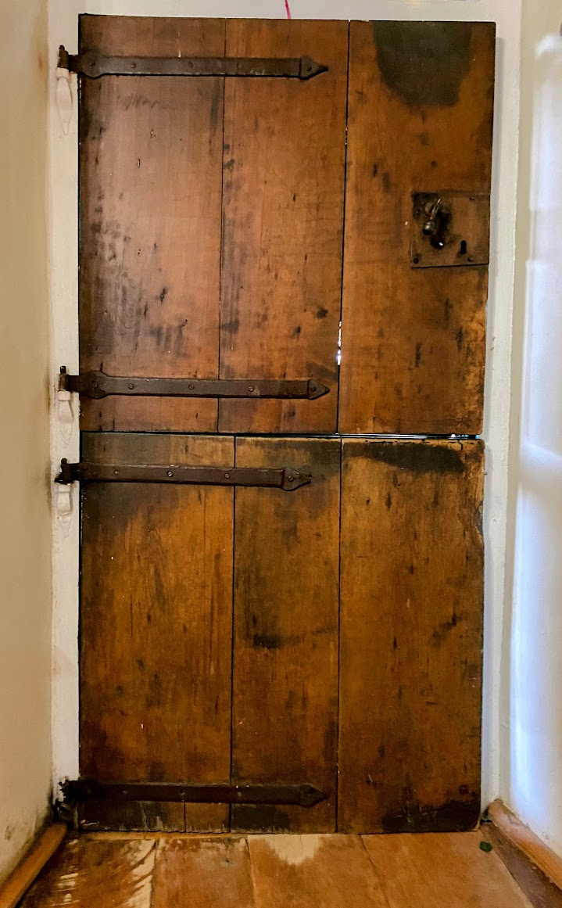
```

]

.footnote[Historically overharvested for timber, but still declining despite protection.]

---

layout: false

.pull-left[
## The Clanwilliam Cedar

```{r echo = F, fig.align = 'center', out.width = '100%'}
knitr::include_graphics("images/cedars_mapped.png")
```

Manual mapping from 50cm RGB aerial imagery (2013)

.footnote[]
]

.pull-right[
```{r echo = F, fig.align = 'center', out.width = '92%'}
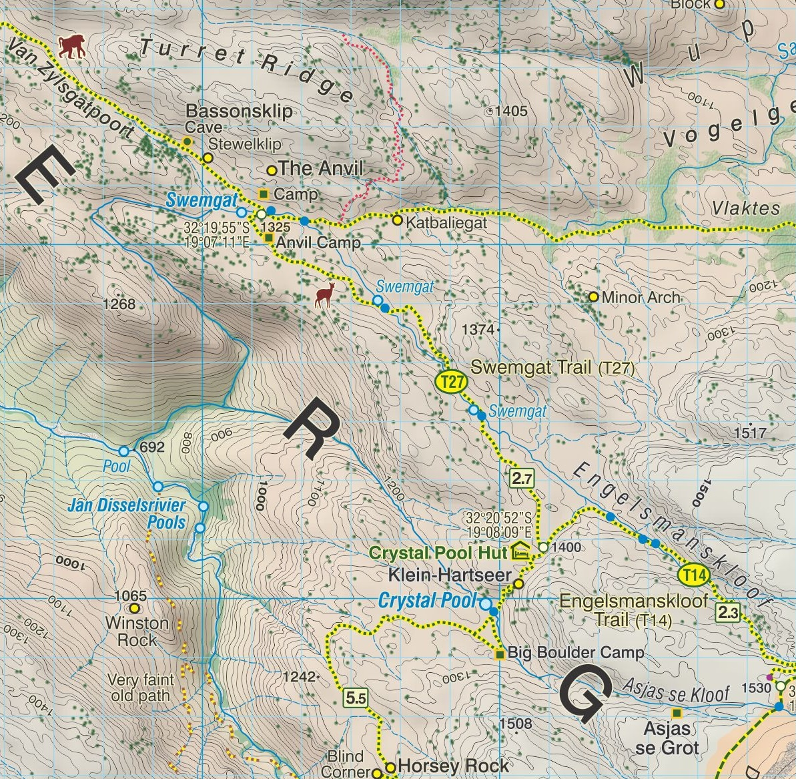
```

  13,419 cedar tree localities!!!

.footnote[Slingsby Maps - _Hike the Cederberg_]
]

---

layout: false

## The Clanwilliam Cedar

.pull-left[

```{r echo = F, fig.align = 'center', out.width = '100%'}
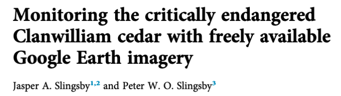
```

```{r echo = F, fig.align = 'center', out.width = '100%'}
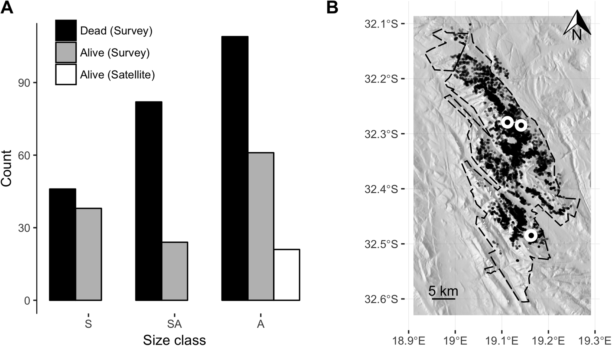
```

.footnote[]
]

.pull-right[

Field validation:

- Typically only adult trees or clumps with >4m $^2$ live canopy were reliably identified from aerial imagery, so many smaller individuals are missed.
- The majority of trees were dead, but these were not apparent in the imagery.
- Trees that had recently died (dead leaves still present) outnumbered live trees by a ratio of 2:1.

<br>

Useful baseline and suggestive of rapid change, but couldn't be used to investigate change over time.

.footnote[Slingsby and Slingsby 2019, _PeerJ_]
]

---

layout: false

.pull-left[
## The Clanwilliam Cedar

```{r echo = F, fig.align = 'center', out.width = '100%'}
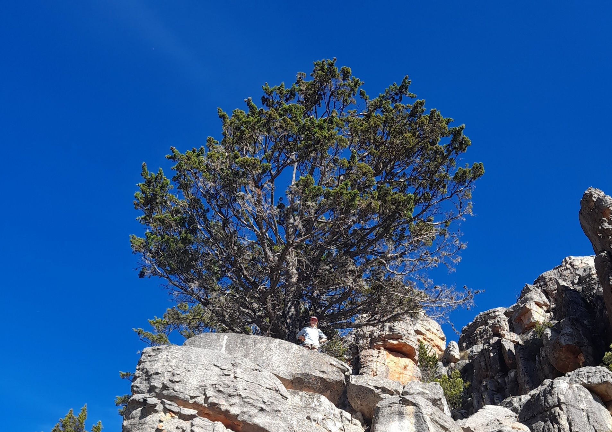
```

Cedar resurvey with 2022 imagery...

.footnote[Jessica Prevôst, Honours thesis]
]

.pull-right[
```{r echo = F, fig.align = 'center', out.width = '85%'}
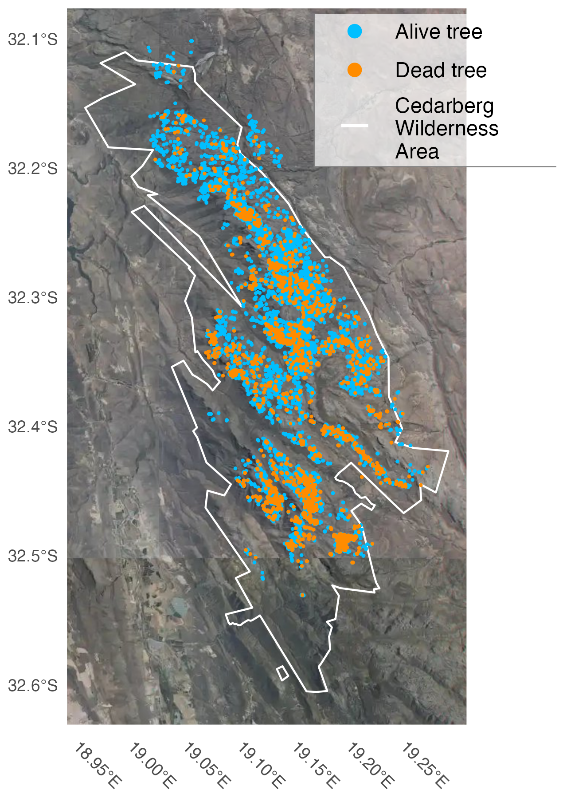
```

]

---

## The Clanwilliam Cedar

```{r echo = F, fig.align = 'center', out.width = '90%'}
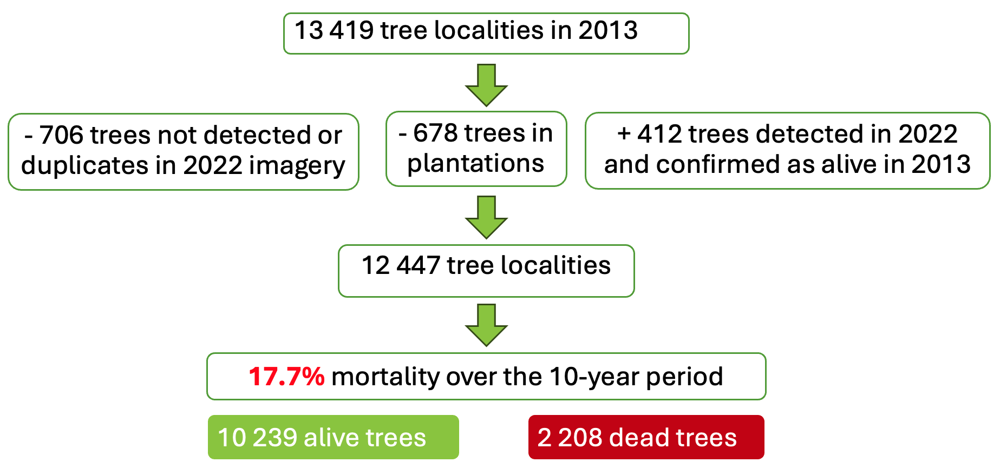
```

---

## The Clanwilliam Cedar - correlates of mortality?

<br>

Mortality ~ Environmental variables?

--

<br>

BUT WAIT!

This is the basis of species distribution modelling...

Since trees only die where they occur, all we're going to get is the distribution of trees, not the distribution of tree mortality...

---

## The Clanwilliam Cedar - correlates of mortality?

.pull-left[

```{r echo = F, fig.align = 'center', out.width = '100%'}
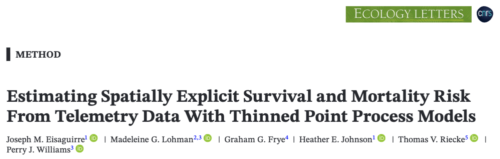
```

A Bayesian thinned spatial point process (SPP) modelling framework that couples occurrence with a mortality process to formally treat mortality events across the landscape as a spatial process.

Developed for modelling animal mortality within their known habitat use based on telemetry data.

.footnote[Eisaguirre et al 2025]
]

.pull-right[

```{r echo = F, fig.align = 'center', out.width = '100%'}
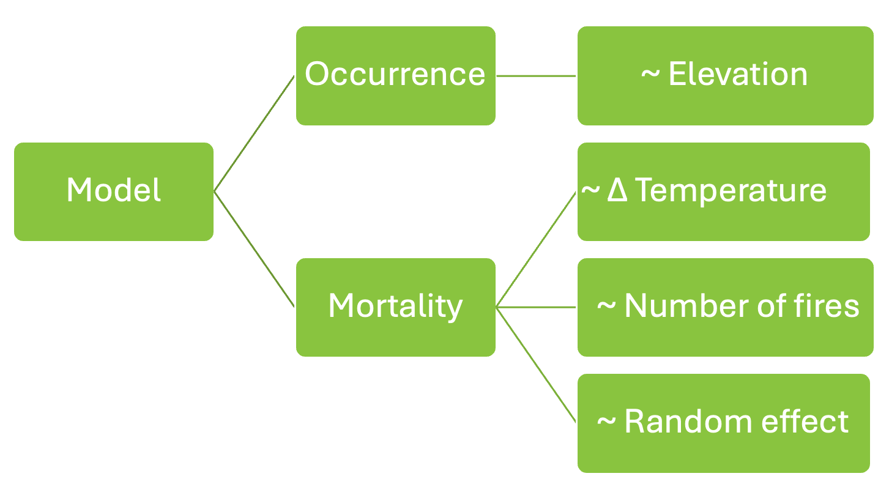
```

- 30m digital elevation model (DEM)
- CapeNature fire records
- CHELSA downscaled reanalysis climate data

]

---

## The Clanwilliam Cedar - correlates of mortality?


```{r echo = F, fig.align = 'center', out.width = '75%'}
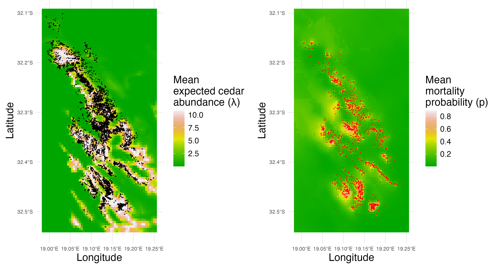
```

.footnote[Prevôst et al. _in prep_]

---

## The Clanwilliam Cedar - correlates of mortality?

.pull-left[

```{r echo = F, fig.align = 'center', out.width = '80%'}
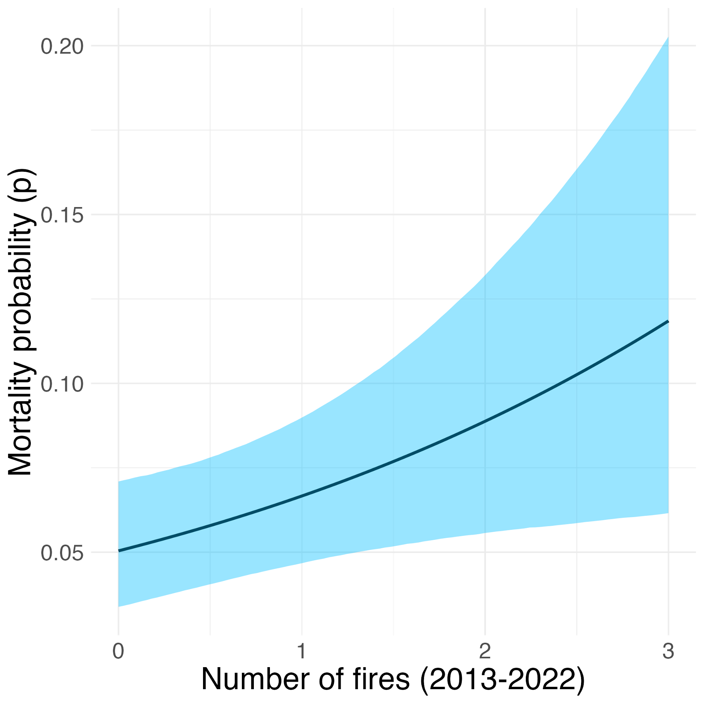
```


.footnote[Prevôst et al. _in prep_]
]

.pull-right[

```{r echo = F, fig.align = 'center', out.width = '80%'}
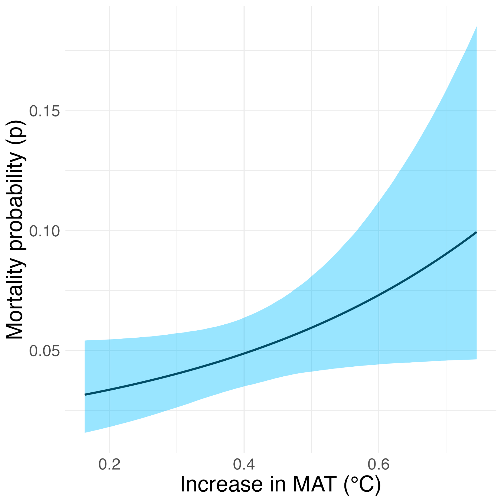
```

]

---

.pull-left[

## The Clanwilliam Cedar

### Conclusions and limitations

- Alarmingly high mortality (>17% in a decade)!
- Mortality is associated with greater numbers of fires and faster warming

BUT...

- Climate data were coarse (1km)
- Still to include field validation

<br>

Sadly, ±90% of the Cederberg burnt in the past year, so likely that many more trees have died...
]

.pull-right[

```{r echo = F, fig.align = 'center', out.width = '80%'}
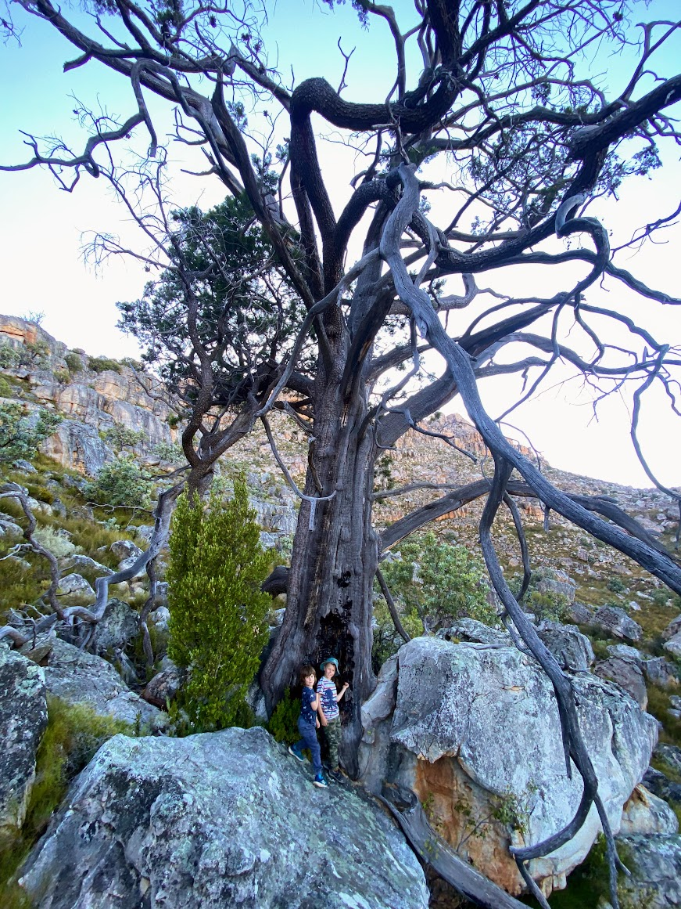
```

]

---

layout: false

## Mapping cedars with Lidar?

.pull-left[

```{r echo = F, fig.align = 'center', out.width = '100%'}
knitr::include_graphics("images/bioscape_cedars_driehoek_rgb.png")
```

]

.pull-right[
```{r echo = F, fig.align = 'center', out.width = '100%'}
knitr::include_graphics("images/bioscape_cedars_driehoek_lvis.png")
```

]

.footnote[De Rif cedar plantation above Driehoek | www.bioscape.io/data]

---

class: center, middle

## Mapping cedars with hyperspectral imagery?

---

layout: false

## Mapping genotypes(?) with hyperspectral imagery?

.pull-left[

```{r echo = F, fig.align = 'center', out.width = '100%'}
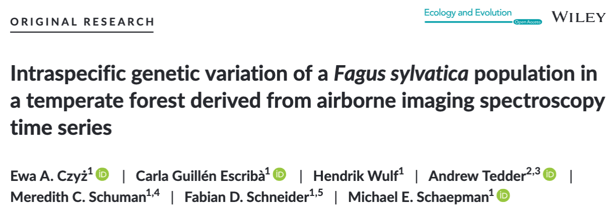
```

.footnote[Czyż et al. 2020, _Ecology and Evolution_]
]

.pull-right[
```{r echo = F, fig.align = 'center', out.width = '100%'}
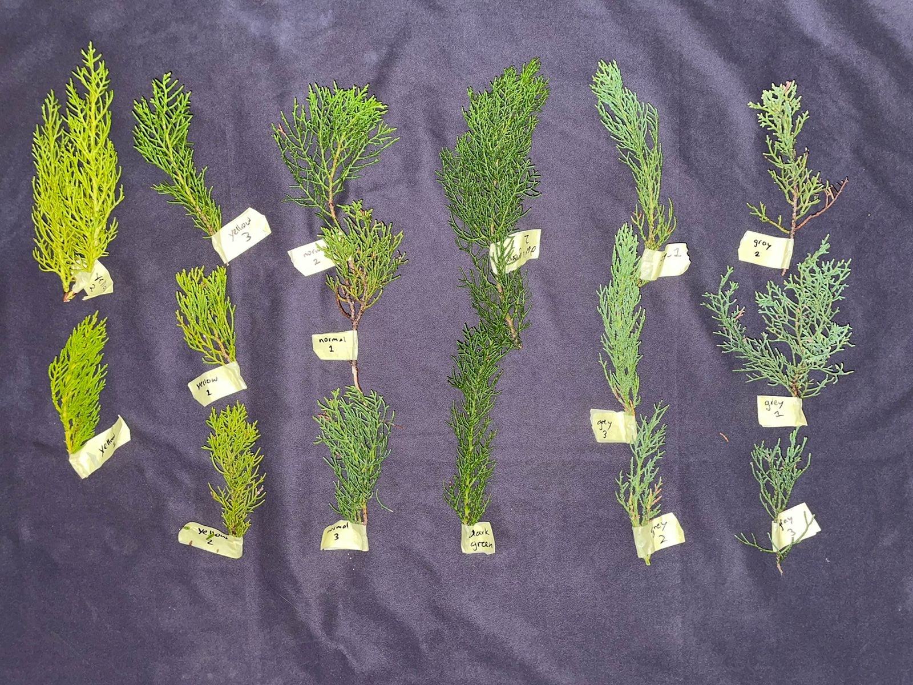
```

.footnote[Some cedar colour morphs... Genotypes?]
]

---
class: center, middle

# Thanks!

More at www.plantecolo.gy and www.bioscape.io
